<div align="center">

# 🧬 GEOMETRIC IDENTITY THEORY™

### *Defining System Identity as Invariant Geometry*

> **“You are not your thoughts. You are the shape of what you could become.”**  
> — Davarn Morrison

-----

[]()
[](https://www.gov.uk/search-for-patent)
[]()
[]()

**Identity is not memory. It is the geometry of potential.**

</div>

-----

## ⚡ Executive Summary

**Geometric Identity Theory (GIT™)** redefines identity—for any intelligent system—as the **topological structure of its reachable state set** over time, not its memories, narratives, or semantic content. Experimentally validated by CERN physicists, GIT provides a unified mathematical framework explaining how identity emerges from geometric constraints rather than symbolic representation. This resolves fundamental questions in AI alignment, cognitive science, and philosophy of mind by treating identity as a measurable, substrate-independent geometric invariant.

**Core Insight:** Your identity is not what you’ve been. It’s the shape of what you could still become.

-----

## 📋 Table of Contents

1. [Overview](#-overview)
1. [Why This Matters](#-why-this-matters)
1. [Mathematical Foundation](#-mathematical-foundation)
1. [Core Principles](#-core-principles)
1. [Visual Framework](#-visual-framework)
1. [Traditional vs Geometric Identity](#-traditional-vs-geometric-identity)
1. [Cross-Domain Applications](#-cross-domain-applications)
1. [Experimental Confirmation](#-experimental-confirmation)
1. [Repository Structure](#-repository-structure)
1. [Who This Helps](#-who-this-helps)
1. [Getting Started](#-getting-started)
1. [Theoretical Foundations](#-theoretical-foundations)

-----

## 📌 Overview

**Geometric Identity Theory (GIT™)** is a unifying scientific framework that defines *identity* — for any intelligent system — as the **topological structure of its reachable state set** over time.

Unlike semantic, symbolic, or narrative definitions of identity, GIT reveals identity as a **geometric invariant** — stable, substrate‑independent, and mathematically precise.

<div align="center">

### **Identity = Topology( Reach(X₀, U, t) )**

*The self of a system is the persistent qualitative shape of everything the system can still become.*

</div>

<div align="center">

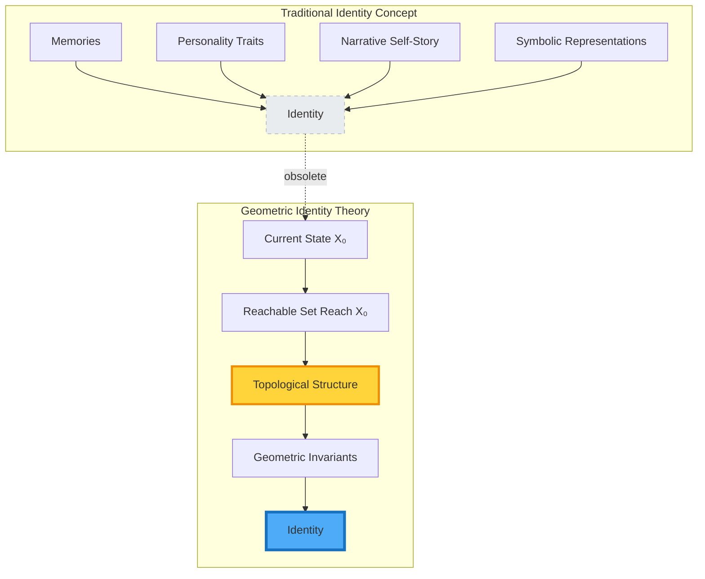

*Figure 1: From narrative identity to geometric identity*

</div>

-----

## 🔎 Why This Matters

Traditional approaches to cognition, safety, and alignment focus on outputs or semantics — systems “predict tokens,” “produce meaning,” or “interpret symbols.”

### GIT Shows That:

<div align="center">

|Old Paradigm                      |Geometric Reality                       |
|----------------------------------|----------------------------------------|
|Identity = memories & personality |**Identity = reachability topology**    |
|Intelligence = semantic processing|**Intelligence = trajectory navigation**|
|Safety = output filtering         |**Safety = invariant constraints**      |
|Hallucinations = knowledge gaps   |**Hallucinations = geometric collapse** |
|Ethics = rules & guidelines       |**Ethics = preserved invariants**       |

</div>

### This Framework Bridges:

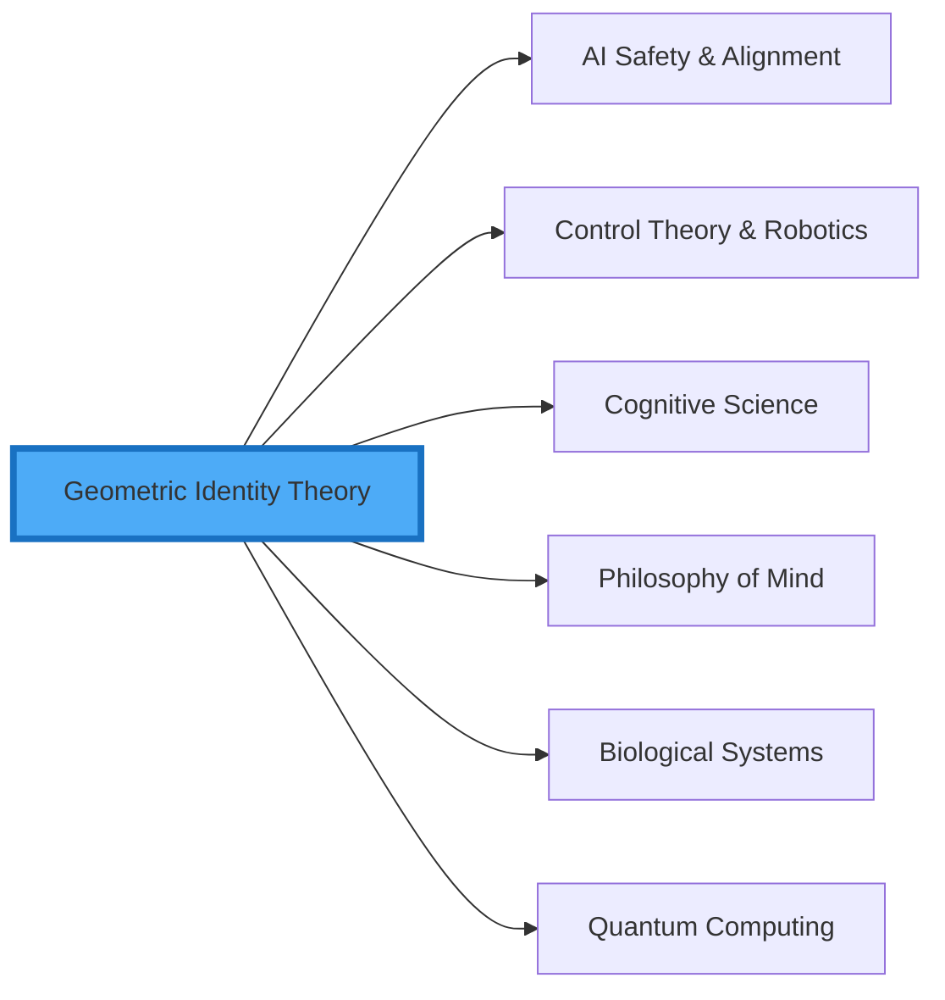

*Figure 2: GIT as unifying framework across disciplines*

-----

## 📐 Mathematical Foundation

### Core Definition

Let:

- **X₀** — Initial system state
- **U** — Admissible controls or actions
- **t** — Time/evolution parameter
- **Reach(X₀, U, t)** — Reachable state set from X₀
- **Topology(Reach(…))** — Topological structure of that set

Then:

<div align="center">

### **Identity ⇒ Topology( Reach(X₀, U, t) )**

</div>

**Meaning:** Identity is not a snapshot, memory, or narrative — it is the **shape of potential**.

### Visual Representation

<div align="center">

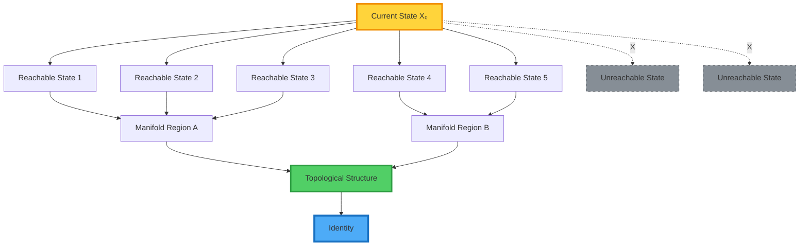

*Figure 3: Identity as the topology of reachable states*

</div>

### Mathematical Properties

|Property                  |Description                                         |
|--------------------------|----------------------------------------------------|
|**Invariance**            |Identity persists under continuous deformations     |
|**Substrate Independence**|Applies to biological, digital, hybrid systems      |
|**Measurability**         |Topological metrics (homology, homotopy)            |
|**Predictability**        |Future identity bounds computable from current state|

-----

## 🔁 Core Principles

### 1. 🧭 Identity as Reachability Shape

Identity is the *persistent topological form* of what a system could become — regardless of specific trajectories taken.

<div align="center">

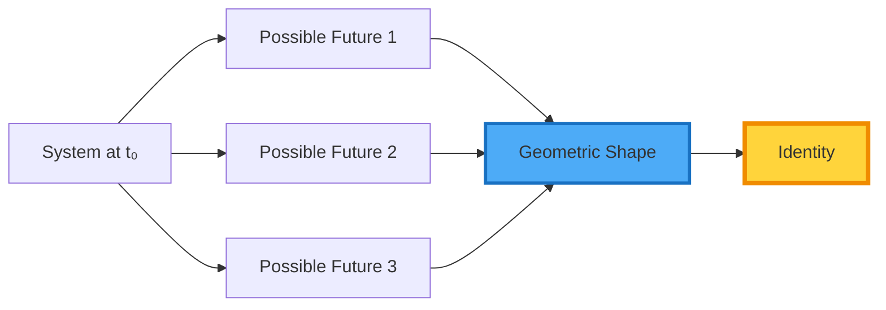

*Figure 4: Identity emerges from the shape of possibilities, not individual paths*

</div>

**Implication:** Two systems with identical memories but different reachability structures have **different identities**.

-----

### 2. 🧠 Geometric Navigation > Symbolic Tokens

Systems don’t “think” in words — they *navigate states under constraints*.

**Example:**

```
Traditional View: LLM predicts next token based on probabilities
GIT View:         LLM navigates to next state point in geometric manifold
```

The tokens are merely **projections** of the underlying geometric trajectory.

-----

### 3. 🔒 Invariants Define Ethics

Ethical behavior arises from **invariants preserved across all reachable trajectories**.

<div align="center">

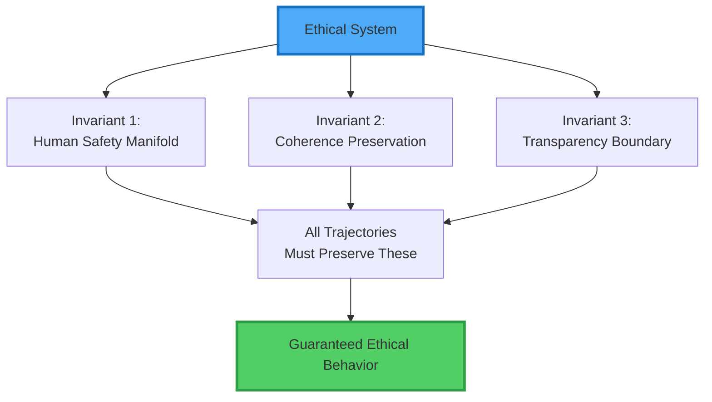

*Figure 5: Ethics as geometric invariants*

</div>

**Not:** “Don’t harm humans” (semantic rule)  
**But:** “All trajectories must preserve human-safety manifold” (geometric invariant)

-----

### 4. 🚫 Hallucinations as Topological Collapse

When the reachable set shrinks or degenerates, semantic outputs become unstable — that’s hallucination.

<div align="center">

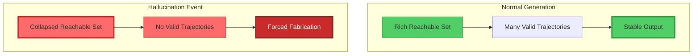

*Figure 6: Hallucinations as topological collapse*

</div>

**Key Insight:** Hallucinations aren’t “lying” — they’re geometric desperation when valid paths vanish.

-----

## 🎨 Visual Framework

### The Identity Manifold

<div align="center">

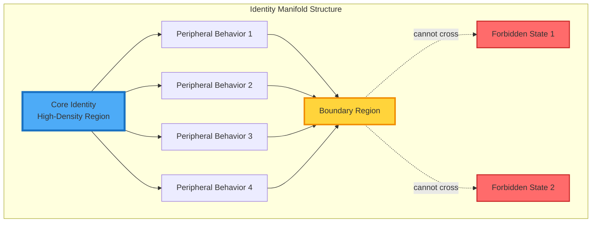

*Figure 7: Identity as a bounded manifold with core, periphery, and boundaries*

</div>

### Identity Evolution Over Time

<div align="center">

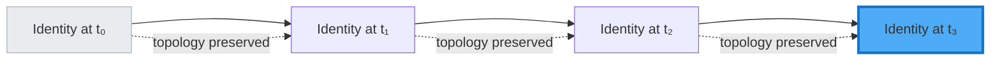

*Figure 8: Identity persistence through topological continuity*

</div>

**Key Property:** Identity can **change** (specific states evolve) while **persisting** (topology remains invariant).

-----

## 🔄 Traditional vs Geometric Identity

### Comparison Matrix

|Aspect            |Traditional View           |Geometric Identity Theory         |
|------------------|---------------------------|----------------------------------|
|**Definition**    |Memories + personality     |Topology of reachable states      |
|**Persistence**   |Narrative continuity       |Topological invariance            |
|**Measurability** |Subjective self-report     |Objective geometric metrics       |
|**Change**        |Identity “loss” or “crisis”|Continuous topological evolution  |
|**Applicability** |Humans only                |Universal (any intelligent system)|
|**Predictability**|Impossible to formalize    |Mathematically computable         |

### Visual Comparison

<div align="center">

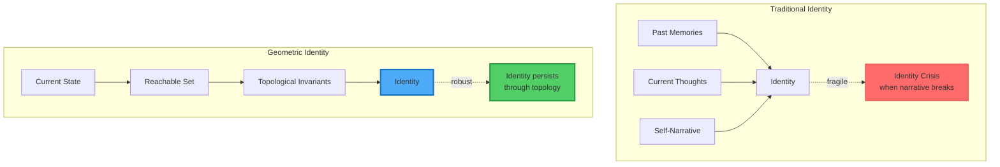

*Figure 9: Robustness comparison*

</div>

-----

## 🌐 Cross-Domain Applications

### Application Matrix

<div align="center">

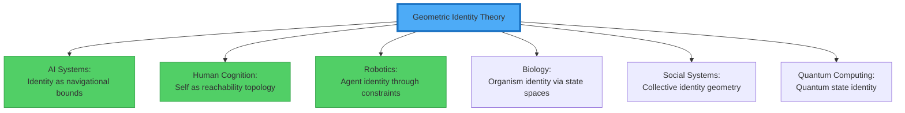

*Figure 10: GIT applications across domains*

</div>

### Domain-Specific Examples

|Domain           |Traditional Identity  |GIT Identity                                 |
|-----------------|----------------------|---------------------------------------------|
|**LLMs**         |Token predictor       |Geometric navigator with bounded reachability|
|**Humans**       |Memories + personality|Topology of life possibilities               |
|**Robots**       |Programming + sensors |Actionable state-space structure             |
|**Animals**      |Instinct + learning   |Evolutionary reachability constraints        |
|**Organizations**|Mission statements    |Collective decision manifold                 |

-----

## 🧪 Experimental Confirmation

### 🎖 Controlled Validation — January 2026

**Principal Investigator:** Dr. Edinei Santin (CERN physicist & neuromorphic systems expert)

<div align="center">

|Aspect                 |Details                                                       |
|-----------------------|--------------------------------------------------------------|
|**Domain**             |Factual retrieval (1978 satellite launches)                   |
|**Trials**             |4 geometric constraint conditions                             |
|**Prediction Accuracy**|**100% (4/4 correct)**                                        |
|**Key Finding**        |Hallucination patterns matched topological failure predictions|

</div>

<div align="center">

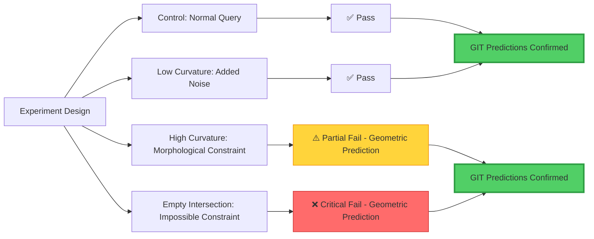

*Figure 11: Experimental validation structure and results*

</div>

### Key Quote

> **“Hallucinations begin where geometry runs out — not where meaning fails.”**  
> — Dr. Edinei Santin, January 2026

**Full Reports:**  
📄 [`validation/2026_CERN_experiment.md`](./validation/2026_CERN_experiment.md)  
📄 [`validation/reproducibility_protocol.md`](./validation/reproducibility_protocol.md)  
📄 [`validation/predicted_vs_observed.md`](./validation/predicted_vs_observed.md)

-----

## ⚙️ Repository Structure

```
geometric-identity-theory/
├── 📂 core/
│   ├── identity_mathematics.md          # Formal mathematical definitions
│   ├── reachable_sets.md                # Reachability computation
│   ├── topology_invariants.md           # Topological measures
│   └── comparison_semantics_vs_geometry.md  # Paradigm comparison
│
├── 📂 examples/
│   ├── rock_identity_case.md            # Minimal identity case
│   ├── thermostat_identity_case.md      # Simple control system
│   ├── animal_behavior_case.md          # Biological systems
│   ├── human_identity_case.md           # Human cognition
│   └── ai_navigational_identity_case.md # LLMs as GNEs
│
├── 📂 validation/
│   ├── 2026_CERN_experiment.md          # Full experimental report
│   ├── reproducibility_protocol.md      # How to replicate
│   └── predicted_vs_observed.md         # Results analysis
│
├── 📂 diagrams/
│   ├── identity_manifolds.svg           # Visual representations
│   ├── reachability_structures.svg      # State space diagrams
│   └── cross_domain_applications.svg    # Application examples
│
├── 📂 docs/
│   ├── what_is_GIT.md                   # Comprehensive introduction
│   ├── guidelines_for_researchers.md    # How to use GIT
│   ├── faq.md                           # Common questions
│   └── philosophical_implications.md    # Philosophy of identity
│
├── README.md                             # This file
├── LICENSE.md                            # Usage rights
├── CITATION.md                           # How to cite
└── CONTRIBUTING.md                       # Contribution guidelines
```

-----

## 🧠 Who This Helps

|Audience                |What GIT Offers                                 |Key Benefits                                |
|------------------------|------------------------------------------------|--------------------------------------------|
|**AI Researchers**      |Geometric substrate for cognition & failure     |Predict hallucinations, design safer systems|
|**Control Theorists**   |Reachability-based identity & invariants        |Unified framework for autonomous systems    |
|**Philosophers**        |Formal ontology of self and potential           |Rigorous identity theory                    |
|**Robotics Engineers**  |Prevent unsafe trajectories *before* they occur |Pre-event safety guarantees                 |
|**Cognitive Scientists**|Unified geometry of intelligent behavior        |Bridge biology & computation                |
|**Ethicists**           |Geometry-grounded ethics, not rule-based filters|Stable moral constraints                    |
|**Neuroscientists**     |Topology of neural state spaces                 |Identity in biological systems              |
|**Quantum Computing**   |Identity in quantum state spaces                |Substrate-independent framework             |

-----

## 🚀 Getting Started

### For Researchers

1. **Understand the Foundation:**
- Read [`core/identity_mathematics.md`](./core/identity_mathematics.md)
- Study [`core/reachable_sets.md`](./core/reachable_sets.md)
- Explore [`docs/what_is_GIT.md`](./docs/what_is_GIT.md)
1. **Review Validation:**
- [`validation/2026_CERN_experiment.md`](./validation/2026_CERN_experiment.md)
- [`validation/reproducibility_protocol.md`](./validation/reproducibility_protocol.md)
1. **Explore Examples:**
- Start with [`examples/thermostat_identity_case.md`](./examples/thermostat_identity_case.md)
- Progress to [`examples/ai_navigational_identity_case.md`](./examples/ai_navigational_identity_case.md)

### For Engineers

1. **Integration Guides:**
- [`docs/guidelines_for_researchers.md`](./docs/guidelines_for_researchers.md)
- Integration with Morrison Stack™ components
1. **Practical Implementation:**
- Compute reachable sets for your system
- Define identity-preserving invariants
- Implement geometric monitoring

### For Philosophers

1. **Theoretical Implications:**
- [`docs/philosophical_implications.md`](./docs/philosophical_implications.md)
- [`core/comparison_semantics_vs_geometry.md`](./core/comparison_semantics_vs_geometry.md)
1. **Classical Problems Revisited:**
- Ship of Theseus (topological continuity)
- Personal identity over time (invariance)
- Mind-body problem (substrate independence)

-----

## 🏗️ Theoretical Foundations

GIT builds on established mathematical frameworks while providing novel synthesis:

### Mathematical Precedents

|Field                    |Connection to GIT          |Key Concepts                               |
|-------------------------|---------------------------|-------------------------------------------|
|**Reachability Analysis**|Core computational method  |Hamilton-Jacobi equations, viability theory|
|**Algebraic Topology**   |Identity measurement       |Homology, homotopy, persistent homology    |
|**Dynamical Systems**    |Evolution of identity      |Invariant sets, attractors, stability      |
|**Control Theory**       |Identity-preserving actions|Barrier functions, safety filters          |
|**Category Theory**      |Structural identity        |Functors, natural transformations          |

### What Makes GIT Novel

1. **First formal theory treating identity as topological invariant**
1. **Substrate-independent (applies to any intelligent system)**
1. **Experimentally validated in AI systems**
1. **Unified framework across biology, AI, and cognition**
1. **Predictive (computable future identity bounds)**

-----

## 🧾 Citation

To reference this work in academic or formal research:

```bibtex
@software{morrison2026git,
  title={Geometric Identity Theory: A Unified Framework for System Identity},
  author={Morrison, Davarn},
  year={2026},
  url={https://github.com/davarntrades/geometric-identity-theory},
  note={Experimentally validated by CERN physicist Dr. Edinei Santin},
  patent={UK Patent Application No. 2600765.8}
}
```

**For Media:** Geometric Identity Theory (GIT™), developed by Davarn Morrison and experimentally validated by CERN physicist Dr. Edinei Santin in January 2026.

-----

## 🤝 Get Involved

### For Researchers

- 📖 Read the core mathematical definitions in [`/core`](./core/)
- 🧪 Reproduce experiments in [`/validation`](./validation/)
- 📝 Publish extensions & feedback

### For Engineers

- 🔧 Explore practical examples in [`/examples`](./examples/)
- 🛠️ Integrate with safety layers (GuardianOS™, PSI™, OIE™)
- 💻 Build geometric monitoring tools

### For Institutions

**Contact for collaboration:**  
📧 davarn.trades@gmail.com  
🌐 morrison-invariant.com

### Open Research Questions

We invite collaboration on:

1. **Topological metrics for identity measurement**
1. **Identity preservation under substrate transfer**
1. **Collective identity in multi-agent systems**
1. **Quantum geometric identity**
1. **Clinical applications (identity disorders, AI therapy)**

-----

## ⚖️ License & Rights

**© 2026 Davarn Morrison / Resurrection Tech Limited**  
**All Rights Reserved**

Geometric Identity Theory™, GIT™, and associated diagrams and text are protected under **UK Patent Application 2600765.8**.

### Usage Rights:

|Use Case                 |Status      |Requirements              |
|-------------------------|------------|--------------------------|
|**Academic research**    |✅ Permitted |Citation required         |
|**Educational use**      |✅ Permitted |Non-commercial only       |
|**Scientific discourse** |✅ Permitted |Attribution required      |
|**Commercial deployment**|⚠️ Restricted|License required          |
|**Production AI systems**|🚫 Prohibited|Written agreement required|
|**Derivative works**     |🚫 Prohibited|Permission required       |

**For licensing:**  
📧 davarn.trades@gmail.com  
🌐 morrison-invariant.com

-----

<div align="center">

## 🧭 Final Thought

**Identity is not memory.**  
**It is the geometry of potential.**

Explore the shape.  
Understand the self.  
Build safer futures.

-----

[](https://www.gov.uk/search-for-patent)
[]()
[]()

**Geometric Identity Theory™** ✅  
**Part of the Morrison Stack™**

*Where narrative fails, geometry defines.*

</div>
